# PRD — PL Scout Engine

> Working title. A club-need-first, explainable recruitment engine for the Premier League.

| | |
|---|---|
| Owner | Yengnong Xiong |
| Status | Draft v1.1 |
| Last updated | 2026-10-03 |
| Build agent | Claude Code (see `CLAUDE.md`) |
| Deployment | Local only (not publicly deployed) |

**Changelog**
- v1.1 (2026-10-03): Applied ADR-0001 — React + TypeScript SPA replaces Streamlit (§10, §10.1, §12, §13, §14, §16, §18, §19).
- v1.0 (2026-10-03): Initial draft.

## 1. Summary

PL Scout Engine is a local dashboard for club decision-makers. You pick a Premier League club; the engine analyses every match played this season (blended with last season while samples are still small), finds the squad's weakest areas relative to a benchmark you choose, and recommends Premier League players who would fix those weaknesses. Every recommendation comes with an explainable fit score, the player's Transfermarkt estimated market value (with its as-of date), and an auto-generated scouting report, produced without any paid AI API.

The spirit is Moneyball: replace reputation and gut feel with evidence, and look for value the market is mispricing. The non-negotiable product principle: **no number without a receipt.** Every figure shown can be traced to a source and a timestamp.

## 2. Problem

- Most scouting tools are player-first (search a player, then ask "would he fit?"). Real recruitment starts from a club need ("our No. 6 doesn't win the ball back high enough").
- Free tools don't connect squad diagnosis → candidate search → evidence → written report in one flow.
- Free advanced data got scarcer in 2026: FBref lost its Opta advanced stats in January 2026, and the popular `transfermarkt-datasets` snapshot stopped updating in mid-2026. A credible free tool now needs its own multi-source pipeline with explicit data-quality handling.
- Naive stats mislead. A dominant possession team's midfielders make fewer tackles because their team has the ball, not because they don't press. Without possession adjustment, a tool would flag Manchester City's midfield as defensively weak for the wrong reason.

## 3. Goals and non-goals

**Goals**
- G1: Diagnose a club's weaknesses at team, position-group and player level, with evidence.
- G2: Recommend Premier League players who fix each weakness, ranked by an explainable fit score, with market value context.
- G3: Generate copy-ready scouting reports locally for free (no paid LLM tokens).
- G4: Trust. Every displayed number is traceable to source + as-of time; proxies are clearly labelled; uncertainty is shown.
- G5: Portfolio. Demonstrate production-style SWE (SQL, REST API, system design, testing, CI, DSA) and PM practice (PRD, prioritisation, metrics, ADRs).

**Non-goals**
- Public deployment, user accounts, multi-tenant hosting.
- Live in-match data, betting, injury prediction, video analysis.
- Paid data feeds or paid LLM APIs.
- Candidates outside the Premier League (MVP; see Stretch S6).
- Predicting transfer fees. We show Transfermarkt *estimates* and a model's stats-implied value, never a "price."

## 4. Personas and jobs to be done

| Persona | Job to be done | What they need |
|---|---|---|
| Technical Director | "Where is our squad weakest, and what should our next window prioritise?" | Ranked needs, severity, budget context |
| Head of Recruitment / Scout | "Give me a defensible shortlist for this need." | Filterable shortlist, fit breakdown, shareable report |
| Head Coach / Manager | "Would this player do the job our system needs better than who we have?" | Candidate-vs-incumbent comparison, role/style fit |
| Data Analyst | "Can I trust and explain these numbers?" | Sources, freshness, definitions, sample sizes, methodology |

## 5. User stories

**P0 (MVP)**

| ID | Story | Acceptance criteria |
|---|---|---|
| US-01 | As a TD, I select a club by typing its name, including nicknames ("Man City", "Spurs") | Fuzzy search resolves common aliases; unknown input shows suggestions |
| US-02 | As a TD, I see the club's top 3–5 needs ranked by severity | Each need names a position group + KPI(s), shows the gap vs benchmark, and lists evidence (player, value, percentile, peer count, minutes, source, as-of) |
| US-03 | As a TD, I see individual "weak links" | Regular starters below the configured percentile on a key KPI are flagged with evidence; small samples are labelled |
| US-04 | As a scout, I get a ranked shortlist per need | Candidates show fit score + component breakdown, age, position, minutes, availability, TM value + its date |
| US-05 | As a scout, I filter the shortlist | Filters: max market value, age range, min minutes, exclude clubs |
| US-06 | As a scout, I generate a scouting report for any candidate | Copyable plain text; states the data window; covers strengths, concerns, fit vs club need, caveats; every number matches the database |
| US-07 | As a coach, I compare a candidate with the incumbent | Side-by-side percentile bars on the need KPIs with deltas |
| US-08 | As an analyst, I see data freshness and methodology | Lists each source, last fetch time, coverage, KPI definitions, weights, proxies, known limitations |

**P1**

| ID | Story |
|---|---|
| US-09 | Similar-player finder ("players like X") with top-k results and similarity scores |
| US-10 | Data-driven role archetypes (e.g., "deep build-up CM") on player pages |
| US-11 | "Moneyball view": strong fits the market appears to undervalue (stats-implied value vs TM value, with uncertainty band) |
| US-12 | Season mode toggle: current only / current + last blended (default) / last season only |
| US-13 | Benchmark toggle: league average / top 6 of last season (default) / top 4 / custom |
| US-14 | Goalkeeper module with clearly limited, caveated metrics |

**P2**

| ID | Story |
|---|---|
| US-15 | Event-data metrics (progressive passes/carries, defensive actions by zone, xT) via experimental adapter |
| US-16 | Backtest page: did past diagnoses match the positions clubs actually signed? |
| US-17 | Export report to PDF/Markdown |
| US-18 | Age-curve projections |

## 6. Core user flow

1. **Select club** (fuzzy search), season mode, benchmark.
2. **Club Diagnosis:** headline needs, position-group heat strip, weak links, depth/age/contract risks.
3. **Click a need → Shortlist:** ranked candidates with filters and fit breakdown.
4. **Click a candidate → Player page:** percentiles vs position peers, comparison with incumbent, similar players, role archetype, scouting report.
5. **Methodology & Data:** always one click away; every chart footer shows sources and as-of.

## 7. Data sources and data reality

### 7.1 Sources

| Source | What we take | Access | Tier | Notes / risks |
|---|---|---|---|---|
| Fantasy Premier League official API (`fantasy.premierleague.com/api/`: `bootstrap-static/`, `element-summary/{id}/`, `fixtures/`) | Per-match minutes, starts, goals, assists, xG, xA, xG conceded on pitch, defensive fields (tackles, recoveries, clearances/blocks/interceptions, defensive contribution), cards, availability status/news, teams, fixtures | Public JSON, no auth | 1 (core) | Undocumented; fields can change, so validate schema each run and verify exact field names against a live payload. `id` is reassigned every season; `code` is stable. API only shows current state, so snapshot every run |
| `vaastav/Fantasy-Premier-League` (GitHub) | Past seasons' per-gameweek FPL data | GitHub CSV | 1 (history) | Needed because `element-summary` history empties after a season ends |
| Understat (via `soccerdata`, pinned) | Player match stats: xG, npxG, xA, shots, key passes, xGChain, xGBuildup; shot events with situation (open play, set piece…); team match stats: PPDA, deep completions | Scraped | 1 (core) | Cache aggressively; polite rate; adapter fails loudly on schema change |
| FotMob (via `soccerdata`) | Team possession % per match (for possession adjustment) | Scraped | 1b | If unavailable, defensive stats are shown unadjusted and labelled |
| Transfermarkt | Estimated market value + TM's own "last updated" date, detailed position, date of birth, contract expiry | Local self-hosted scraper (e.g., `felipeall/transfermarkt-api`) or own polite scraper | 1 (core) | No official API; anti-bot pages can return HTTP 200/202 with no data, so validate parsed payloads. Personal, low-volume use only |
| `dcaribou/transfermarkt-datasets` | Historical valuations, transfers, players | GitHub/Kaggle snapshot | 1 (history) | Updates paused; valuations end June 2026; no 2026/27 squads. Use for history/model training and as a clearly labelled stale fallback only |
| Manual override CSVs | Corrections to values, positions, ID mappings | Committed files | 1 | Every override row has a reason + date |
| StatsBomb open data (GitHub, `statsbombpy`) | Historical event data | GitHub JSON | Dev/validation | Not current season. Used to develop and unit-test event-derived metric definitions |
| WhoScored (via `soccerdata`, Selenium) | Opta event stream for current PL matches | Scraped, fragile | 2 (experimental, off by default) | Anti-bot; local-only; never required for MVP |
| FBref | None | n/a | Not used for current stats | Opta advanced stats removed January 2026; historical basic stats only |

### 7.2 Honesty rules for key metrics

- **Expected assists (xA):** real metric. Note that Understat xA (xG of shots from a player's key passes) and FPL/Opta xA (probability a pass becomes an assist) are defined differently; each KPI uses one source and says which.
- **Pressing:** *team* pressing intensity = PPDA from Understat (real metric; lower = more intense). *Player-level* pressure counts are not freely available for the current PL, so the product uses a labelled proxy: possession-adjusted defensive activity (tackles + recoveries, plus clearances/blocks/interceptions for defenders) per 90.
- **Progressive passes:** not available from Tier-1 sources. Tier-1 proxy for ball progression = xGBuildup/90 and xGChain/90. True progressive passes/carries arrive only with the Tier-2 event-data adapter (US-15).
- Every KPI in config has `source` and `is_proxy`. The UI shows a "proxy" badge with a tooltip explaining what it stands in for.
- Missing data is shown as "Not available," never as 0, never silently imputed.

### 7.3 Legal and ethical guardrails

Personal, non-commercial, not deployed. Low request rates, aggressive caching, identifiable User-Agent, no parallel scraping of Transfermarkt. Raw scraped data is gitignored and never committed; tests use small trimmed or synthetic fixtures.

## 8. Analytics methodology

### 8.1 Normalisation
All counting stats → per 90 minutes. Never per match (double gameweeks and substitute appearances distort per-match rates).

### 8.2 Season blending (early-season stability)
Early in the season only a handful of matchweeks have been played, so current-season rates are noisy.

`blended_rate = (m_cur·r_cur + λ·m_prev·r_prev) / (m_cur + λ·m_prev)`

Default λ = 0.5; previous-season minutes capped (default 2,000). A prior season at another PL club counts. A prior season in another league (Understat covers the top 5) is included but flagged "different league, not adjusted for league strength." The season-mode toggle can disable blending.

### 8.3 Shrinkage (small-sample protection)
Empirical-Bayes shrinkage toward the position-group mean:

`shrunk = (n·rate + k·prior_mean) / (n + k)`, where n = blended minutes / 90 and k is a per-stat stabilisation constant (config; sensible defaults, refine later via split-half reliability). Displayed values are raw rates; rankings and percentiles use shrunk rates. Minutes are always shown next to any rate.

### 8.4 Possession adjustment
Defensive volume stats are adjusted per match: `padj = raw × (0.5 / opp_possession_share)`, multiplier clipped to a configurable range (default 0.67–1.5), then summed and converted to per 90. If possession is missing for a match, that match is unadjusted and the KPI is flagged.

### 8.5 Positions
FPL only has GKP/DEF/MID/FWD, which is too coarse. Use Transfermarkt's detailed position mapped to position groups **CB, FB, DM, CM, AM, W, ST** (GK in P1). Mapping lives in `config/positions.yaml`. Data-driven role archetypes (8.10) complement listed positions but never replace them.

### 8.6 Percentiles
Within position group, among PL players meeting the minutes threshold (default 600 blended minutes), computed with SQL `PERCENT_RANK()` window functions and mirrored in pandas for tests. Inverse metrics (xG conceded on pitch, cards) are flipped so a higher percentile is always better. Always display the peer count n.

### 8.7 KPI catalogue (initial; tunable in `config/kpis.yaml`)

Sources: FPL = defensive fields, xGC on pitch, cards. Understat = xG, npxG, xA, shots, key passes, xGChain, xGBuildup. "Def. activity" and xGBuildup/xGChain are proxies (§7.2).

| Group | KPIs and initial weights |
|---|---|
| CB | Def. activity PAdj/90 .30 · CBI PAdj/90 .20 · xGBuildup/90 .25 · xGC/90 on pitch (inverse) .20 · cards/90 (inverse) .05 |
| FB | xA/90 .25 · xGChain/90 .20 · xGBuildup/90 .15 · Def. activity PAdj/90 .25 · xGC/90 on pitch (inverse) .15 |
| DM | Recoveries PAdj/90 .25 · Tackles PAdj/90 .20 · xGBuildup/90 .30 · xGC/90 on pitch (inverse) .15 · cards/90 (inverse) .10 |
| CM | xGBuildup/90 .25 · xGChain/90 .20 · xA/90 .20 · Def. activity PAdj/90 .20 · npxG/90 .15 |
| AM | xA/90 .30 · key passes/90 .25 · npxG/90 .25 · xGChain/90 .20 |
| W | npxG/90 .25 · xA/90 .25 · shots/90 .15 · key passes/90 .15 · xGChain/90 .20 |
| ST | npxG/90 .40 · shots/90 .20 · npxG/shot .15 · xA/90 .10 · xGChain/90 .15 · (goals − xG shown with weight 0; finishing is noisy) |
| GK (P1) | Saves/90, (xGC − goals conceded)/90, labelled rough proxies (post-shot xG isn't freely available) |
| Team | xG/90, xGA/90, PPDA, PPDA allowed, deep completions for/against, set-piece xG for/against, open-play xGA |

Weights are expert-set starting points, documented in an ADR and tunable. Example config shape:

```yaml
position_groups:
  CM:
    kpis:
      - id: xg_buildup_p90
        label: "Build-up involvement (xGBuildup/90)"
        source: understat
        weight: 0.25
        higher_is_better: true
        is_proxy: true
        proxy_for: "ball progression"
```

### 8.8 Club diagnosis algorithm
1. For each position group at the club, compute a **group score per KPI**: the minutes-weighted mean of the club's players' percentiles (weights = current-season minutes for *this* club in that group).
2. Compute the **benchmark** score the same way for the benchmark clubs (default: top 6 of last season's table, excluding the selected club).
3. **Gap** = benchmark − club, per KPI. **Need severity** = Σ (KPI weight × max(0, gap)).
4. **Weak links:** players with ≥ 40% of available minutes and a percentile < 30 on any KPI with weight ≥ 0.20 (thresholds in config).
5. **Risk flags:** depth (one player > 80% of group minutes with no backup above the 40th percentile), age (minutes-weighted age ≥ 30), contract (key player's contract expires within 12 months, when known).
6. **Output:** ranked `Need` objects, each with evidence records (player, KPI, raw value, percentile, n peers, minutes, source, as-of).
7. Team-level KPIs (PPDA, set-piece xGA…) produce team-level needs mapped to the position groups most responsible (mapping in config).

### 8.9 Recommendation scoring
Candidate pool: PL players in the need's position group, excluding the selected club, passing hard filters (budget, age, min minutes, availability status).

`FitScore (0–100) = 0.40·NeedFill + 0.25·RoleQuality + 0.15·Reliability + 0.10·StyleFit + 0.10·AgeProfile`

- **NeedFill:** weighted percentile on the deficient KPIs.
- **RoleQuality:** overall position-weighted KPI score.
- **Reliability:** minutes volume + current availability (FPL status).
- **StyleFit:** cosine similarity between the candidate's current team style vector (possession, PPDA, directness proxies) and the target club's.
- **AgeProfile:** distance from a configurable peak-age window per position group.
- **Upgrade gate:** the candidate must beat the incumbent (club's minutes leader in that group) on NeedFill by ≥ 15 percentile points; otherwise hidden by default or tagged "sideways move."
- The UI always shows the component breakdown. Weights live in `config/fit_weights.yaml`.

### 8.10 Machine learning
1. **Role archetypes (unsupervised):** Gaussian Mixture Model on standardised per-90 vectors of outfield players (≥ 900 blended minutes); k chosen by BIC in the range 6–12; clusters auto-labelled by their most distinguishing features, with a manual rename map in config. Evaluate with the BIC curve, silhouette score, and stability across seeds (adjusted Rand index).
2. **Similarity search:** cosine similarity on standardised, KPI-weighted vectors; top-k via heap. At ~600 players brute force is the right choice; a hand-built KD-tree lives in `dsa/` with a benchmark explaining when it would win.
3. **Stats-implied market value (the Moneyball model):** gradient-boosted trees (scikit-learn `HistGradientBoostingRegressor`) predicting log(Transfermarkt value at season end) from age, age², position group, minutes share, blended per-90 KPIs, team strength, and contract length when available.
   - Trained on historical PL player-seasons with a **time-based split** (e.g., train ≤ 2024/25, test 2025/26) to prevent leakage.
   - Baseline: median value by position × age bucket. Report MAE on the log scale and median absolute % error vs baseline.
   - Quantile models (10th/90th percentile) give an uncertainty band. Output label: Undervalued / Fair / Premium.
   - Caveat shown in the UI: the model learns the market's own biases; it is a stats-implied value, not a fee prediction.
4. **Age curves (P2):** delta-method aging curves from historical data.

All ML is seeded and reproducible. Trained artefacts are saved with a metadata JSON (data window, features, metrics, git SHA).

### 8.11 Evaluation
- `scout train` generates `docs/EVALUATION.md`: value-model metrics vs baseline, GMM diagnostics, similarity sanity examples.
- Backtest (P2, US-16): run diagnosis on end-of-2024/25 data for all clubs and compare top-3 position needs with the positions of first-team signings in summer 2025 (Transfermarkt transfers). Report precision@3 vs a naive baseline. This is exploratory; clubs sign players for many reasons.

## 9. Scouting report generation ("AI" without paid tokens)
1. **Fact sheet:** the engine builds a JSON of every number and claim allowed in the report.
2. **Template renderer (default):** Jinja2 templates + phrase banks keyed to percentile bands (≥ 90 elite, 75–89 strong, 50–74 above average, 25–49 below average, < 25 weak). Seeded variation so reports don't read robotically. Caveats are auto-inserted (small sample, proxy metric, different-league prior season, stale market value).
3. **Optional local LLM:** if `REPORT_ENGINE=ollama`, a locally run open model (via Ollama, model set by env var) rewrites the template report for fluency at low temperature, with an instruction to add no facts.
4. **Grounding validator:** every number and proper noun in the output must exist in the fact sheet (with rounding tolerance). Any violation discards the LLM output, falls back to the template, and logs the event.
5. **Report sections:** header (name, club, age, position, TM value + date, contract), verdict, why he fits [club] (need vs incumbent), strengths, concerns, role/style, comparable players, data notes (sources, window, minutes).

## 10. System architecture

```mermaid
flowchart LR
  subgraph S[Sources]
    FPL[FPL API]
    US[Understat]
    FM[FotMob]
    TM[Transfermarkt]
    SB[StatsBomb open data]
  end
  S --> ING["Ingestion adapters<br/>rate limit · cache · retries"]
  ING --> RAW[("Bronze: raw snapshots<br/>data/raw (timestamped)")]
  RAW --> STG["Silver: clean · validate ·<br/>entity resolution"]
  STG --> WH[("Gold: SQL warehouse<br/>SQLite (Postgres-compatible)")]
  WH --> FEAT["Feature layer<br/>per-90 · blend · shrink · PAdj · percentiles"]
  FEAT --> ENG["Engines + ML<br/>diagnosis · recommend · roles · value"]
  ENG --> REP["Report generator<br/>template / local LLM + grounding"]
  ENG --> API[FastAPI REST]
  REP --> API
  API --> UI["React + TypeScript SPA<br/>(Vite)"]
```



Key design decisions:
- **Batch, not real-time:** ingestion and builds run via CLI. The API and UI only read the warehouse, so the app is fast and works offline.
- **Adapter pattern:** each source sits behind one `SourceAdapter` interface. When a source dies (as FBref's advanced data did), only one module changes.
- **Medallion layers (bronze/silver/gold):** raw data is always replayable and transforms are reproducible.
- **API-first:** the React app talks to the API over HTTP through a client generated from the API's OpenAPI schema, so front end and back end evolve independently and stay type-safe end to end.
- **Config over code:** thresholds, weights, rate limits and mappings live in YAML.

### 10.1 Tech stack (all free / open source)

| Concern | Choice |
|---|---|
| Language | Python 3.12 |
| Packaging | `uv`, `pyproject.toml` |
| Data | pandas, numpy, `soccerdata`, `statsbombpy` (dev) |
| Validation | pandera (DataFrames), pydantic v2 (API + config) |
| Database | SQLAlchemy 2.0 + Alembic migrations; SQLite default with Postgres-compatible SQL (docker-compose Postgres = stretch) |
| ML | scikit-learn |
| Entity resolution | rapidfuzz, unidecode + hand-written union-find |
| HTTP | httpx + tenacity (retries) |
| API | FastAPI + uvicorn |
| Front end | React + TypeScript (strict), Vite, React Router, TanStack Query, TanStack Table, Recharts, Tailwind CSS |
| API types | openapi-typescript + openapi-fetch, generated from FastAPI's OpenAPI schema |
| Front-end quality | Vitest, React Testing Library, MSW, ESLint, Prettier; Playwright smoke test (stretch) |
| Reports | Jinja2; optional Ollama (local LLM) |
| CLI | Typer |
| Quality | pytest, pytest-cov, ruff, mypy, pre-commit, GitHub Actions CI |

## 11. Data model (gold layer)

| Table | Grain | Key columns |
|---|---|---|
| `dim_team` | club | team_id, name, short_name, aliases, fpl_code, understat_id, tm_id |
| `dim_player` | player | player_id, canonical_name, birth_date, fpl_code, understat_id, tm_id, detailed_position, position_group |
| `dim_season` | season | season_id (e.g. "2026-27"), start_date, end_date, is_current |
| `dim_match` | match | match_id, season_id, gameweek, kickoff, home/away team_id, score, source ids |
| `fact_player_match` | player × match | minutes, started, goals, assists, xg, npxg, xa, shots, key_passes, xg_chain, xg_buildup, tackles, recoveries, cbi, def_contribution, xgc_on_pitch, cards, team_id, source, fetched_at |
| `fact_team_match` | team × match | xg, xga, npxg, ppda, ppda_allowed, deep, deep_allowed, possession, set-piece xg/xga |
| `fact_market_value` | player × valuation | value_eur, tm_last_updated, fetched_at, source (live / snapshot / override) |
| `fact_player_status` | player × snapshot | fpl_status, news, chance_of_playing, contract_expiry |
| `source_snapshot` | source × run | source, fetched_at, rows, checksum, status, error |
| `entity_map_review` | unresolved record | source, source_id, name, team, best_candidate, score |
| `player_season_features` (materialised) | player × season mode | per-90, blended, shrunk, PAdj values, percentiles, minutes, n_peers, flags |

Analytical SQL lives in `.sql` files (CTEs + window functions) and is unit-tested against pandas equivalents.

## 12. API (FastAPI, read-only)

| Method & path | Purpose |
|---|---|
| `GET /health` | Liveness + warehouse version |
| `GET /meta/freshness` | Per-source last fetch, coverage, staleness flags |
| `GET /teams` | Clubs in the current season |
| `GET /teams/search?q=` | Fuzzy club search (aliases) |
| `GET /teams/{team_id}/diagnosis?season_mode=&benchmark=` | Needs, weak links, risks with evidence |
| `GET /teams/{team_id}/recommendations?need_id=&max_value_eur=&min_age=&max_age=&min_minutes=&limit=` | Ranked shortlist with fit breakdown |
| `GET /players/search?q=` | Fuzzy/prefix player search |
| `GET /players/{player_id}` | Profile, percentiles, availability, value |
| `GET /players/{player_id}/similar?k=` | Top-k similar players |
| `GET /players/{player_id}/report?team_id=` | Scouting report (+ fact sheet) |
| `GET /compare?a=&b=` | Side-by-side KPIs |

Pydantic response models, one consistent error schema, OpenAPI docs at `/docs`, in-process LRU cache for hot endpoints.

The OpenAPI schema is exported with `scout export-openapi` to `web/openapi.json`. In development the Vite dev server proxies `/api` to FastAPI; CORS allows only `http://localhost:5173`.

## 13. Dashboard (React + TypeScript SPA)

| Route | Page | Contents |
|---|---|---|
| `/` | Club Diagnosis | Club search (aliases), season mode, benchmark; top needs; position-group heat strip; weak links; depth/age/contract risks |
| `/clubs/:teamId/needs/:needId` | Shortlist | Ranked candidates, filters (max value, age, minutes, exclude clubs), fit-component bars, Moneyball view toggle |
| `/players/:playerId` | Player | Header facts, percentile bars vs position peers, availability, similar players, role archetype, scouting report with copy button |
| `/compare?a=&b=` | Compare | Candidate vs incumbent, side-by-side bars with deltas |
| `/methodology` | Methodology & Data | Sources, freshness, KPI definitions, weights, proxies, limitations |

Behaviour:
- Filters, season mode and benchmark live in the URL, so every view is bookmarkable and the back button works.
- Server state is handled by TanStack Query (caching, retries). No global state library unless clearly needed.
- Every view has loading, empty ("Not available" / "Run `scout ingest`") and error states.

Design principles:
- Minimal and calm: light theme, one accent colour, at most ~3 charts per view.
- Horizontal percentile bars instead of radars.
- Consistent rounding: 1 decimal for per-90, € m for values.
- Every chart footer shows "Source · as of"; proxy badges where relevant.
- Keyboard accessible, AA contrast, colour never the only signal.
- Designed for laptop screens; mobile is not a target.

## 14. Non-functional requirements
- Local-only. The UI and API never call external sources at request time.
- Diagnosis and recommendation endpoints: p95 < 500 ms on a laptop with features materialised.
- `scout build` (no network): < 10 min.
- Polite ingestion: configurable per-source rate limits (Transfermarkt default ≤ 1 request / 3 s), caching with TTL, retries with backoff.
- Reproducible: pinned dependencies, seeded ML, model metadata.
- Front end: production build loads in < 2 s locally; route changes with cached data < 300 ms.
- Observability: structured logs; `scout doctor` reports freshness, coverage and validation status.

## 15. Success metrics

| Type | Metric | Target |
|---|---|---|
| North star | Time from "type club name" to a defensible 3-player shortlist with evidence | < 2 minutes |
| Trust | Displayed numbers with source + as-of attached | 100% (enforced by tests) |
| Trust | Shown reports that are grounded (validated LLM output or template fallback) | 100% |
| Data quality | PL minutes mapped across FPL ↔ Understat ↔ Transfermarkt | ≥ 98% |
| Data quality | Validation failures on a successful build | 0 |
| Model | Value model MAE (log scale) vs naive baseline on held-out season | Beat baseline; target ≥ 20% improvement |
| Engineering | Test coverage on core packages; CI | ≥ 80%; green on main |
| Performance | API p95 | < 500 ms |

## 16. Milestones and acceptance criteria

| # | Milestone | Acceptance criteria |
|---|---|---|
| M0 | Foundations: repo skeleton, `pyproject.toml`, uv, ruff/mypy/pytest, CI, config system, Typer CLI skeleton, `docs/PROGRESS.md`, ADR template, plus a `web/` scaffold (Vite + React + TypeScript, ESLint, Prettier, Vitest) so CI covers both stacks from day one | `uv run pytest` and CI green; `scout --help` works |
| M1 | Ingestion (Tier 1): FPL, Understat, FotMob possession, Transfermarkt (scraper + snapshot + overrides), vaastav history, StatsBomb loader; raw snapshot store; rate limiter; retries | Each adapter has offline contract tests with fixtures; `scout ingest --source fpl` writes a timestamped snapshot when run locally |
| M2 | Warehouse: SQLAlchemy models, Alembic migration, loaders, entity resolution, pandera validation, freshness table, `scout doctor` | End-to-end build from fixtures; mapping coverage report; a validation failure stops the build |
| M3 | Feature layer: per-90, blending, shrinkage, possession adjustment, percentiles (SQL + pandas), KPI config | Hand-calculated unit tests for every formula; SQL percentiles match pandas |
| M4 | Diagnosis engine | Deterministic ranked needs for fixture clubs; every need has evidence with source + as-of |
| M5 | Recommendation engine + ML (fit score, upgrade gate, similarity, GMM roles, value model) | `scout train` writes models + `docs/EVALUATION.md`; value model compared to baseline; results reproducible |
| M6 | Reports: fact sheet, templates, optional Ollama, grounding validator | Golden tests for template output; a test injecting a fake number proves the validator rejects it |
| M7 | API | All endpoints tested with TestClient; OpenAPI docs render |
| M8 | Dashboard (React + TypeScript) | All P0 stories demoable on real local data; client generated from OpenAPI; page tests in loading/empty/error/success states; `npm run lint`, `typecheck`, `test` and `build` pass in CI |
| M9 | Evaluation & polish | README with screenshots, architecture diagram, methodology, limitations, and a "How it was made" section; fresh clone → documented steps → working dashboard |

**Stretch:**
- S1: Event-data adapter (WhoScored → SPADL via `socceraction`/`kloppy`; progressive passes, xT).
- S2: GK module.
- S3: Postgres via docker-compose.
- S4: Age curves.
- S5: PDF export.
- S6: Top-5-league candidate pool (Understat).
- S7: Backtest page.

## 17. Risks and mitigations

| Risk | Mitigation |
|---|---|
| A source changes or disappears (FBref precedent) | Adapter pattern, raw snapshots, schema validation, fallbacks, freshness page |
| Transfermarkt blocks scraping | Cache, low rate, snapshot fallback labelled stale, manual overrides, as-of dates everywhere |
| Small early-season samples | Season blending, shrinkage, minutes thresholds, n shown everywhere |
| Possession bias in defensive stats | Possession adjustment; "unadjusted" label if possession is missing |
| Entity-resolution errors | Club blocking + fuzzy match + DOB check + union-find + override CSV + coverage target + review table |
| LLM hallucination | Template default; grounding validator; fallback |
| Proxies mistaken for real metrics | `is_proxy` in config, UI badges, methodology page |
| Scope creep | Milestones with acceptance criteria; stretch list kept separate |
| ToS / data licensing | Personal, non-commercial, not deployed, nothing scraped committed |

## 18. Portfolio mapping

| Skill | Where it shows up |
|---|---|
| SQL | Star-schema warehouse, Alembic migrations, CTE/window-function analytics (`src/scout/db/sql/`) |
| APIs | Consuming FPL/Understat/Transfermarkt; designing a typed REST API with FastAPI |
| System design | Medallion pipeline, adapter pattern, batch vs request path, API-first UI, caching, rate limiting |
| DSA | Heap top-k, KD-tree (benchmarked), LRU cache, token bucket, union-find, trie, Levenshtein DP |
| ML / stats | GMM clustering, similarity search, gradient boosting with time-split evaluation and quantile bands, empirical-Bayes shrinkage |
| PM | This PRD, personas, prioritised stories, success metrics, ADRs, risk register, evaluation/backtest |
| Front end | React + TypeScript SPA, typed client generated from OpenAPI, TanStack Query caching, component tests |
| Engineering hygiene | Tests, CI, typing, linting, reproducibility, documentation |

## 19. Open questions
1. ~~Front end: keep Streamlit (fast, Python-only) or build React + TypeScript on the same API later?~~ **Resolved** by ADR-0001: React + TypeScript.
2. ~~Should goalkeepers be in the MVP despite limited free metrics?~~ **Resolved** (CLAUDE.md locked decisions): not in the MVP; stretch S2.
3. ~~Default benchmark: top 6 of last season, or adapt by club?~~ **Resolved** (CLAUDE.md locked decisions): top 6 of last season's table, with toggles for league / top 4 / custom.
4. Expand candidates to Europe's top 5 leagues later (S6)?

## 20. Glossary
- **xG / npxG:** expected goals / non-penalty expected goals; a measure of shot quality.
- **xA:** expected assists (two definitions exist; see §7.2).
- **xGChain:** total xG of every possession the player was involved in.
- **xGBuildup:** xGChain excluding key passes and shots; measures build-up involvement.
- **xGC on pitch:** xG conceded by the team while the player is on the pitch (FPL).
- **PPDA:** opponent passes allowed per defensive action; lower = more intense pressing.
- **PAdj:** possession-adjusted.
- **Per 90:** rate per 90 minutes played.
- **Percentile:** share of position-group peers the player ranks above.
- **Shrinkage:** pulling small-sample rates toward the group average.
- **Transfermarkt market value:** an estimate with its own update date; not a transfer fee.