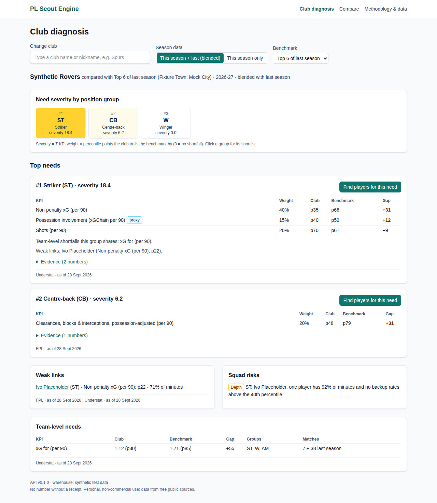
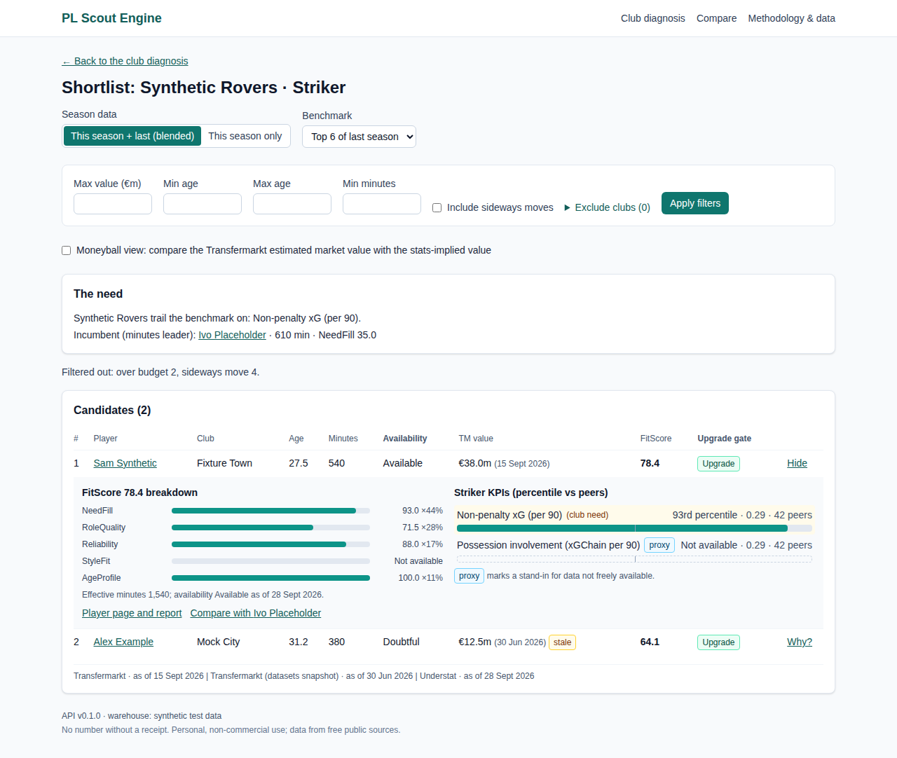
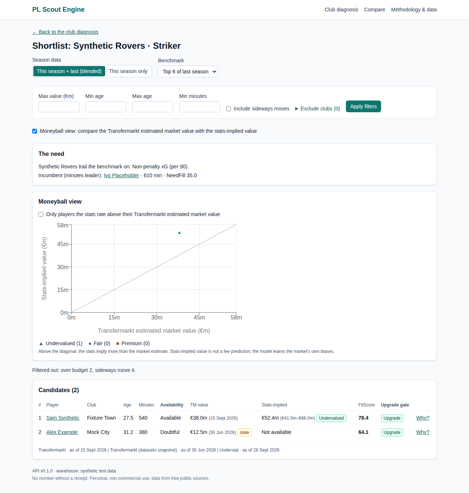
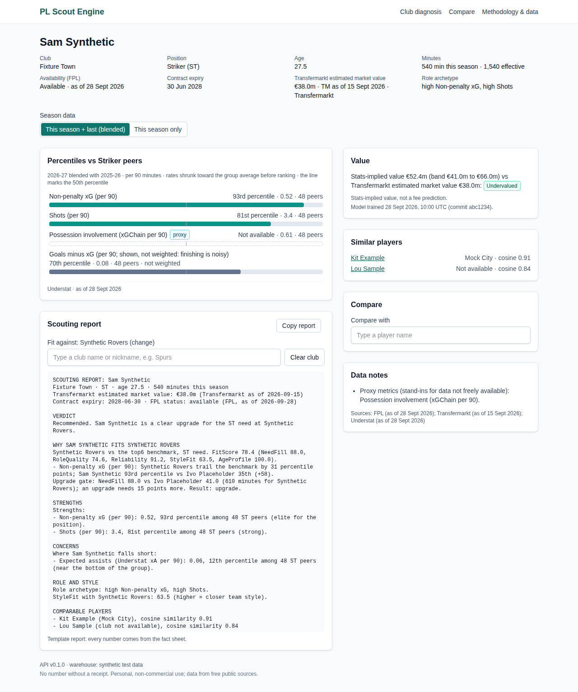
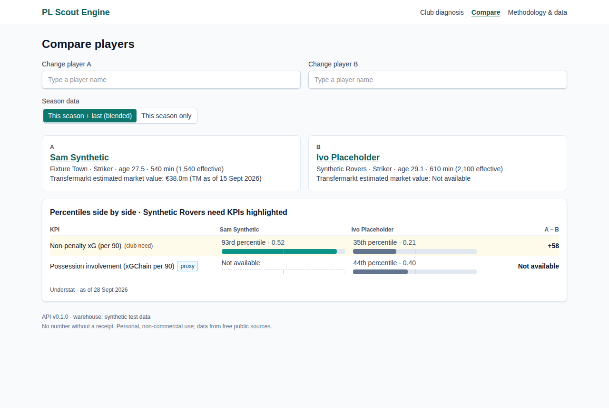

# PL Scout Engine

A local, explainable recruitment dashboard for the Premier League. Pick a club and the engine
diagnoses where its squad is weakest against a benchmark, from this season's match data
(blended with last season while samples are small). It then recommends Premier League players
who fix those weaknesses, each with a transparent fit score, a Transfermarkt estimated market
value (with its as-of date) and a scouting report written without any paid AI API.

**No number without a receipt.** Every figure on screen traces back to a source and a
timestamp, proxies are badged, and missing data says "Not available" instead of pretending
to be zero.



> The screenshots render the front end's synthetic test data (made-up clubs such as
> "Synthetic Rovers" and players such as "Sam Synthetic"), so no real-looking number appears
> here without a receipt. Run `uv run scout demo` to see your own data, and
> `npm run screenshots -- --live` in `web/` to re-shoot them from it.

## Quick start

Requirements: [uv](https://docs.astral.sh/uv/) (it installs Python 3.12 for you), Node.js 22+,
and an internet connection for the first data fetch.

```bash
git clone https://github.com/yengnongxiong/pl-scout-engine.git
cd pl-scout-engine
uv sync --all-extras
uv run scout demo
```

Then open **http://localhost:5173** (API docs at http://127.0.0.1:8000/docs). `scout demo`:

1. **Ingests** every source if there is no data yet: FPL, the FPL history archive, Understat,
   FotMob, Transfermarkt and the transfermarkt-datasets export. It is polite on purpose (rate
   limits from `config/settings.yaml`, caching, retries), so the first run takes a while. A
   source that fails is reported and skipped; only FPL is required.
2. **Builds** the warehouse (validation failures stop the build) and the per-player features.
3. **Trains** the role archetypes and the value model, stores their outputs and writes
   [`docs/EVALUATION.md`](docs/EVALUATION.md).
4. **Serves** the API and the web app (`npm ci` runs first if needed). Ctrl+C stops both.

Later runs reuse the snapshots: `uv run scout demo --skip-build` restarts in seconds, and
`--refresh` fetches new data.

Optional extras:

- **Transfermarkt live values** come through a self-hosted
  [`felipeall/transfermarkt-api`](https://github.com/felipeall/transfermarkt-api) on port 8001
  (`ingest.base_urls.transfermarkt`). Without it, values fall back to the transfermarkt-datasets
  export, labelled stale.
- **Understat and FotMob** go through `soccerdata`, which downloads a small native TLS library
  from GitHub on first use.
- **Local LLM reports**: set `REPORT_ENGINE=ollama` and `SCOUT_OLLAMA_MODEL=<model>` with
  [Ollama](https://ollama.com) running. Rewrites are only shown if every number and name in them
  passes the grounding validator; otherwise the template report is shown.

## What you can do

| Page | What it answers |
|---|---|
| **Club diagnosis** (`/`) | Where is this squad weakest? Need severity per position group, the KPIs behind each need with club vs benchmark gaps and evidence, weak links, depth/age/contract risks, team-level shortfalls. Season mode and benchmark (top 6, top 4, league, custom clubs) live in the URL. |
| **Shortlist** (`/clubs/:id/needs/:need`) | Who fixes it? Ranked candidates with FitScore breakdowns, upgrade-gate verdicts against the incumbent, filters (Transfermarkt estimated market value, age, minutes, excluded clubs) and a Moneyball view comparing the market's estimate with a stats-implied value. |
| **Player** (`/players/:id`) | Percentiles vs position peers, availability, value band, role archetype, similar players, and a copy-ready scouting report against any club's need. |
| **Compare** (`/compare`) | Candidate vs incumbent, side by side, with deltas on the club's need KPIs. |
| **Methodology & data** (`/methodology`) | Source freshness, mapping coverage, KPI definitions and weights, proxies, thresholds, model runs and known limitations. |

| Shortlist with a FitScore breakdown | Moneyball view |
|---|---|
|  |  |

| Player page and scouting report | Candidate vs incumbent |
|---|---|
|  |  |

## How it works

```mermaid
flowchart LR
  subgraph S[Sources]
    FPL[FPL API]
    US[Understat]
    FM[FotMob]
    TM[Transfermarkt]
    HIST[FPL history + TM datasets]
  end
  S --> ING["Ingestion adapters<br/>rate limit · cache · retries"]
  ING --> RAW[("Bronze: raw snapshots<br/>data/raw")]
  RAW --> STG["Silver: validate · resolve players"]
  STG --> WH[("Gold: SQL warehouse<br/>SQLite, Postgres-compatible")]
  WH --> FEAT["Features<br/>per 90 · blend · shrink · possession · percentiles"]
  FEAT --> ENG["Engines + ML<br/>diagnosis · FitScore · roles · similarity · value"]
  ENG --> REP["Reports<br/>fact sheet · template · grounding"]
  ENG --> API[FastAPI, read-only]
  REP --> API
  API --> UI["React + TypeScript SPA<br/>typed client from OpenAPI"]
```



- **Batch, not real-time.** Ingestion and builds run from the CLI; the API and dashboard only
  read the warehouse, so they are fast, work offline and never call a source at request time.
- **One adapter per source** behind a `SourceAdapter` interface, with contract tests that fail
  loudly when a source changes its schema (as FBref did in January 2026).
- **Medallion layers.** Raw snapshots are kept, so every build is replayable.
- **API-first.** FastAPI's OpenAPI schema is exported to `web/openapi.json` and the TypeScript
  types are generated from it; CI fails if they drift.
- **Config over code.** Weights, thresholds, rate limits and mappings live in `config/*.yaml`.

### Methodology in brief

The full method is in [`docs/METHODOLOGY.md`](docs/METHODOLOGY.md) and on the dashboard's
Methodology page.

- Rates are **per 90**, **blended** with last season while this season's sample is small
  (`(m_cur·r_cur + λ·m_prev·r_prev) / (m_cur + λ·m_prev)`, previous minutes capped), and
  **shrunk** toward the position-group mean (`(n·rate + k·prior) / (n + k)`).
- Defensive volume is **possession-adjusted** (`× 0.5 / opponent possession`, clipped); without
  possession data it is flagged "unadjusted".
- **Percentiles** rank players within their position group among those above a minutes
  threshold, always with the number of peers.
- **Diagnosis**: minutes-weighted group percentiles vs the benchmark; severity = Σ KPI weight ×
  shortfall. Weak links, depth, age and contract risks, and team-level needs come with evidence.
- **FitScore** = 0.40 NeedFill + 0.25 RoleQuality + 0.15 Reliability + 0.10 StyleFit + 0.10
  AgeProfile, with an **upgrade gate** against the incumbent.
- **ML**: Gaussian-mixture role archetypes (k by BIC), cosine similarity, and a gradient-boosted
  **stats-implied value** with a quantile band, evaluated on a held-out season against a
  baseline (see [`docs/EVALUATION.md`](docs/EVALUATION.md) after `scout train`). It is not a fee
  prediction.
- **Reports**: a fact sheet, Jinja2 templates with seeded phrase banks, an optional local LLM
  rewrite, and a **grounding validator** that rejects any number, date or name not in the fact
  sheet.

### Known limitations

- Player-level pressing and ball progression are **proxies** (possession-adjusted defensive
  activity; xGBuildup and xGChain): pressure counts and progressive passes need event data that
  is not freely available. Proxies are badged wherever they appear.
- Understat xA and FPL xA are defined differently; each KPI uses one source and says which.
- Transfermarkt values are **estimates**, never prices or fees. The transfermarkt-datasets
  fallback stopped updating in mid-2026 and is labelled stale.
- The value model learns the market's biases and only sees past Premier League seasons of
  current players (survivorship bias).
- Candidates are Premier League players only, and goalkeepers are not rated.
- Personal, non-commercial use only. Scraped data is never committed or redistributed, and the
  app is not deployed.

## Commands

```bash
uv run scout --help
uv run scout ingest --source all        # or fpl, vaastav, understat, fotmob, transfermarkt, ...
uv run scout build                      # raw → validated → warehouse → features
uv run scout train                      # models + docs/EVALUATION.md
uv run scout doctor                     # freshness, coverage, validation, FPL schema
uv run scout diagnose "Spurs"           # needs from the terminal
uv run scout recommend "Spurs" --need CB --max-value 40
uv run scout report "Player Name" --team "Spurs"
uv run scout api                        # FastAPI on :8000
uv run scout export-openapi             # writes web/openapi.json

cd web && npm ci && npm run dev         # Vite on :5173, proxies /api to :8000
```

## Development

```bash
make check        # ruff, mypy, pytest (with coverage) and the web lint/typecheck/test/build
make contract     # export OpenAPI, regenerate TS types, fail on drift
```

- **Python** 3.12, uv, Typer, pydantic, SQLAlchemy 2 + Alembic, pandas, pandera,
  scikit-learn, FastAPI, Jinja2. Fully typed (mypy strict), ruff for lint and format.
- **Web**: React 19 + TypeScript (strict), Vite, React Router, TanStack Query and Table,
  Recharts, Tailwind; Vitest + Testing Library + MSW; ESLint (typed rules, jsx-a11y) + Prettier.
- **Tests** use only local fixtures and a network guard: hand-calculated tests for every
  formula, SQL queries checked against pandas twins, contract tests per adapter (including
  "schema changed" failures), golden-file report tests, a grounding test that injects fake
  numbers, API tests for every endpoint and error, and page tests in loading, empty, error and
  success states.
- **CI** (`.github/workflows/ci.yml`): `python`, `web` and `contract` jobs.

### Hand-written data structures (`src/scout/dsa/`)

| Module | Used for | Complexity |
|---|---|---|
| `heap_topk` | Shortlists and similar players | O(n log k) |
| `kdtree` | Nearest neighbours (benchmarked against brute force in `scripts/bench_knn.py`) | O(log n + k) average query, low dimensions |
| `lru_cache` | Hot API endpoints (hash map + doubly linked list) | O(1) get/put |
| `token_bucket` | Polite ingestion rate limits | O(1) |
| `union_find` | Merging cross-source player records | ~O(α(n)) |
| `trie` | Club and player search-as-you-type | O(m + r) per prefix |
| `levenshtein` | Fuzzy name matching (checked against rapidfuzz) | O(mn) |

### Repository layout

```text
config/     settings, KPI catalogue and weights, FitScore weights, positions, club aliases
src/scout/  ingest → transform → db (models, migrations, SQL) → features → engines / ml
            → reports → api, plus the Typer CLI (cli.py) and scout demo (demo.py)
web/        React + TypeScript dashboard (openapi.json and generated types committed)
tests/      unit/, integration/, fixtures/ (small synthetic samples only)
docs/       PROGRESS.md, METHODOLOGY.md, EVALUATION.md, decisions/ (ADRs), screenshots/
```

## How it was made

The product owner, Yengnong Xiong, wrote the [PRD](PRD.md) (personas, prioritised user stories,
methodology, milestones and acceptance criteria) and a working agreement for an AI pair,
[`CLAUDE.md`](CLAUDE.md). The code was then built by **Claude Code** in a series of sessions:
first unattended sessions started by an hourly routine, then sessions run from Claude Code on the
web.

- **Milestones M0 to M9** were worked in order, broken into 20–40 minute tasks with acceptance
  checks. [`docs/PROGRESS.md`](docs/PROGRESS.md) holds the task queue, a session log and a log of
  every minor decision with its reasoning. Larger decisions are ADRs in
  [`docs/decisions/`](docs/decisions/), such as React + TypeScript over Streamlit (ADR-0001).
- **Guardrails** from `CLAUDE.md`: only green states are committed; tests are never weakened;
  no blanket `type: ignore` or `eslint-disable`; data-integrity rules (no fabricated or imputed
  numbers, receipts on every metric, "Transfermarkt estimated market value", never "price");
  polite, capped live requests; and synthetic data only in test fixtures.
- **CI as a contract.** When the sandbox could not install packages, changes went through an
  always-green "Preflight" workflow before reaching `main`, so the main branch's CI stayed
  green. When it could, every check ran locally first.
- Questions for the owner went into `docs/PROGRESS.md` with the default that was chosen, so no
  session ever stopped to wait.
